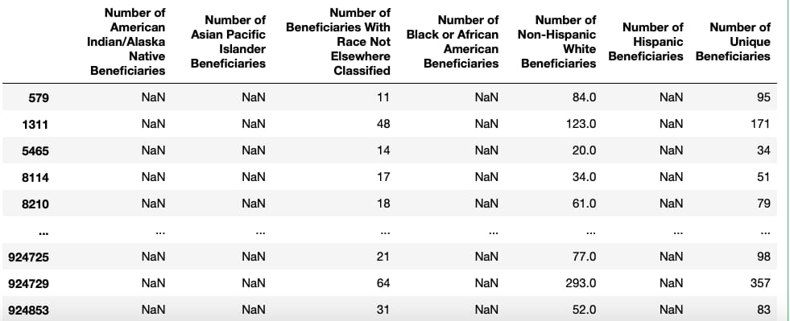
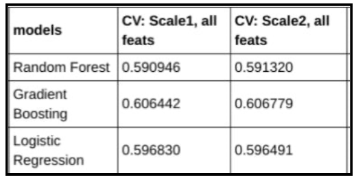
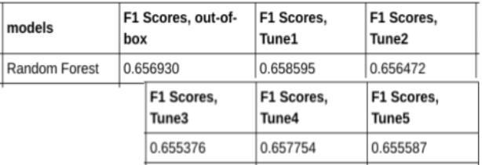

# Problem Identification and Data Sourcing

The overrepresentation of African Americans among Covid-19 infections and death has renewed the national attention to racial disparities in health care. To investigate and measure ways that access to and use of health systems, I turned to the national Medicare program’s publicly available datasets.

While Medicare predominantly affects people 65 years and older, using its data can:
a. offer insight into potential discrimination currently hiding in Medicare service payment distributions
b. develop a method for all public and private insurance companies to measure the effects of their coverage on racial minorities
c. reveal gaps in data collection whose repair will allow better models to catch overall patterns of bias or individual cases of wrongful lapses in coverage.

Raw Medicare dataset available at:
https://data.cms.gov/Medicare-Physician-Supplier/Medicare-Physician-and-Other-Supplier-National-Pro/5fr6-cch3

American Community Survey data available at:
Google Big Query Public Datasets
https://console.cloud.google.com/bigquery?utm_source=bqui&utm_medium=link&utm_campaign=classic&project=sincere-song-280023&p=bigquery-public-data&d=census_bureau_acs&t=zip_codes_2018_5yr&page=table 

# Data Wrangling

See Notebooks/Data_wrangling

The available data included columns for “African-American,” “white,” “Asian Pacific-Islander,” etc. but over half of the sample were missing information for one or all bins, making comparisons of providers by the populations they serve very difficult.

After experimenting with imputing missing values with “0” if missing (this didn’t add up to total number of beneficiaries) or subtracting missing values from the total patients (this didn’t work for rows with multiple missing values), I considered only using rows that included information for the number of African-American patients. This would have cut my dataset from about 1,000,000 rows to about 500,000, which is still a lot of information but only 50% of the original set. Also, which providers would leave out the number of African American patients -- perhaps the providers that don’t serve many? This may introduce bias in the dataset.

Finally, I dropped the columns with missing values. To make up for the missing race information, I merged the dataset with zip-code level population numbers for different races from the American Community Survey. This gives an impression of the population that the provider serves although the racial makeup of the zip code is less granular and less reliable. The American Community Survey data, while containing nulls in other columns, had no missing information for race-specific population.

The other cleaning required looking at unique entries for country and state and decoding unfamiliar entries (including codes for American military service-people abroad). I decided to drop rows that weren’t American states or territories. The zip codes included also need processing, ranging from 1-9 digits. Some were nulls that needed dropping, others were variations of 5-digit zips that needed leading zeros, and other were variations of 9-digit zips that need leading zeros.

# EDA
See Notebooks/EDA for some images of Tableau visuals
See Models/Preprocessing for additional bivariate plots and heatmaps

Initial data exploration showed a lot of variation in coverage rates with many low and many high outliers. But race-specific geography did not obviously correspond to the geographical distribution of rates.

While white zip codes were predominant in the Midwest, Black zip codes in the South, Hispanic zip codes along the southern border, Asian zip codes in the Pacific and Northeast and Native

American zip codes in the Midwest and Alaska, the coverage rates were diffused throughout all regions.
Similarly the distribution plots revealed similar interquartile ranges for all populations but Native Americans who were covered less than other groups.
The spread of the payrates ​did​ differ particularly when looking at the low outliers with were lower for white, Hispanic, Black, and no-majority zip codes.

# Preprocessing
See Models/Processing

The algorithms tested for classification were Random Forest, Gradient Boosting, and Logistic Regression. While I considered SVM, even when training a very small subset of my data (5,000 samples) the model required too much memory to train so I eliminated this algorithm.
Using the F1 score to judge performance, Random Forest ended up out performing the other two by 0.05 and requiring almost 1/10 of the computation time.

# Modeling
See Models/Modeling

Further model processing including using hyperparameter tuning using Randomized Search. The best-judged parameters were then applied to the Random Forest model to improve upon the F1 score. There were improvements in F1 Scores but they were small.

# Analysis

Does the model show bias? According to the Random Forest feature importances, the details about the provider related to charges, submitted, charges per service, number of services, and number of patients were more important in determining coverage than race.

While percent Black, Asian, white, etc. of each zip code population did appear within the top 20 features they were closer to the bottom of these 20. The “majority” features, explaining which group made up the majority of the zip code population, didn’t appear at all. White-majority cities did not reveal patterns of high coverage nor did other-majority cities reveal patterns of low coverage.

Overall the importances of all the top 20 features were 0.09 or below, showing that different factors were important in different estimators. The percent_race columns were 0.03 or below in ‘importance.’

While examining the major errors of the model in the confusion matrices, did the predicted “very high” but actually “very low” samples come from non-white zip codes? Few did. The majority were white cities or no-majority cities, concentrated in the South and Pacific, and tended to be Nurse Practitioners, Physician Assistants or Family Practice. In other words, patterns ​do exist but not revealing overrepresentation of racial minorities.

# Documentation
See Documentation.pdf for pdf form of this README

See Medicare Racial Disparity for pdf of PowerPoint presentation
